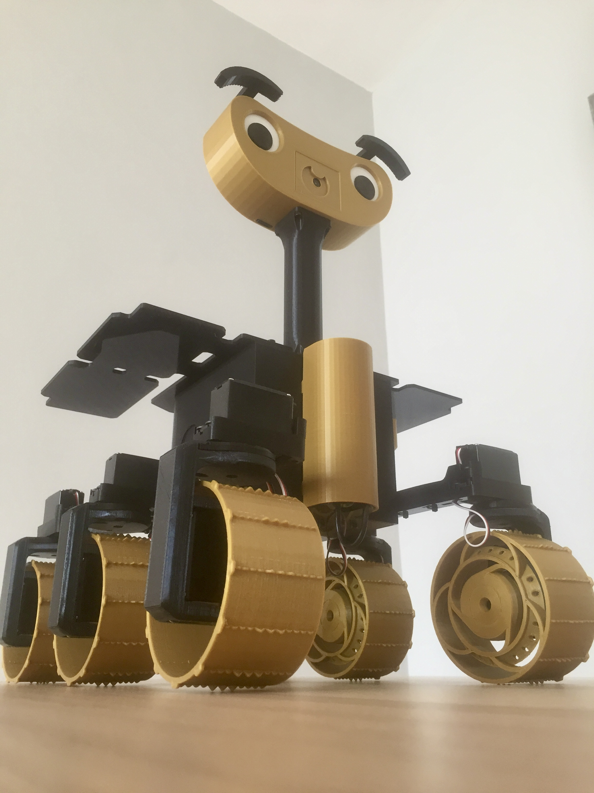

# Marsvin - Software Repository
This repository contains the software of the Marsvin rover.

* **Modified by:** Lucía Teruel Saldaña

* **Master's Thesis:** "Study of the ExoMy rover"

* **Master:** Automatic Control and Robotics (UPC)

* **Based on:** [Exomy ESA's low-cost rover](https://github.com/esa-prl/ExoMy)

